# Laporan Proyek Machine Learning - Muhammad Iodine Hanifan Firdaus
***

## Domain Proyek
***

Pada hari ini jenis mobil di pasaran sudah sangat bervariatif. Ini menyebabkan penjual mobil bekas akan sulit untuk menentukan sebuah harga mobil apabila dilihat dari beberapa variabel yang ada. Satu produsen mobil bisa mempunyai berbagai jenis tipe dan harga yang berbeda-beda. Seperti salah satu produsen mobil populer dari eropa, Ford. Ford pada hari ini sudah memiliki berbagai jenis tipe mobil, untuk lebih jelasnya bisa dilihat di [tautan berikut ini](https://en.wikipedia.org/wiki/Category:Ford_vehicles). Permasalahan ini menyebabkan sulitnya proses mengklasifikasi kelas mobil. Belum lagi ada beberapa variabel tambahan seperti jarak tempuh dan tahun produksi yang beragam.

Orang yang awam mengenai dunia otomotif akan sulit untuk bisa memprediksi harga mobil dikarenakan terdapat banyak sekali faktor yang dapat memengaruhi harga mobil. Diharapkan dengan dilakukannya percobaan ini dapat membantu orang yang ingin memprediksi kelas mobil merk Ford pada hari ini. Dalam menyelesaikan masalah ini dapat dilakukan dengan beberapa metode, seperti K-Nearest Neighbor, Random Forest, dan Adaptive Booster untuk  mengklasifikasikan kelas mobil tersebut sesuai dengan harganya. Beberapa penelitian terkait yang sudah pernah dilakukan :

1. [Presiksi Harga Mobil Bekas dengan Machine Learning](https://jurnal.syntaxliterate.co.id/index.php/syntax-literate/article/view/2716)
2. [Penerapan Regresi Linear dalam Memprediksi Harga Mobil](https://d1wqtxts1xzle7.cloudfront.net/56966166/makalah_ku_senabakti_2015-with-cover-page-v2.pdf?Expires=1659972310&Signature=HUGk5MXCOlDcNlrbSEuAu533bY12wC345tRiQzCFi4kP-SAwkZ~T9bq7Ezz1ZxV0te791q~zUXMsL9CaojpqXUTPskW2ZhWmEGPf6-iov66BMAShkrLmSV3dzXD6o0RJiq~~Gq7vt5~GVPo3BqUcNZdeYsfzUKEBmQbZkPh9sAj4S1s~QIghzUeMvPsPb0qnEmE~uJSGM8K0pJpuP~AnXZS1rOcGXlaphKUduu~XgzsP4Z7E75w6GhWzN5KCWrqnjQOUv7OLWDJGIPfuoFRU3P2hcXJq2n1290yqnjnHx2oai2pRYM3zBU8V3cMH4~SLw05IYBAvED8LQFB83FcLxQ__&Key-Pair-Id=APKAJLOHF5GGSLRBV4ZA) 

Apabila diperhatikan beberapa metode yang diaplikasikan dalam hal ini adalah model regresi linear atau pengklasifikasian seperti random forest, DNN dll. 

## Bussiness Understanding
***
Proyek ini dilakukan untuk  mengklasifikasi kelas mobil sesuai dengan harganya. Klasifikasi kelas dapat dilakukan dengan beberapa kriteria atau variabel yang dapat digunakan untuk menentukan harga mobil. Beberapa contoh variabel yang dapat digunakan seperti tahun produksi, jenis mesin, jenis transmisi, dll (Mengenai variabel yang digunakan akan dibahas lebih detail di bab berikutnya). 

### Problem Statements
* Apa saja variabel yang memengaruhi harga mobil Ford?
* Bagaimana cara mengklasifikasi mobil Ford sesuai dengan harga yang ada di pasaran?
* Algortima machine learning apa yang dapat digunakan untuk mengklasifikasi kelas mobil ford?
### Goals
* Terdapat 9 variabel yang dapat memengaruhi harga mobil apabila dilihat dari [data](https://www.kaggle.com/datasets/adhurimquku/ford-car-price-prediction) yang ada, yaitu model, year, transmission, mileage, fuelType, tax,	mpg, engineSize.
* Melihat data yang ada kemudian mencari pembagian data atau kuartil pada data harga. Kuartil menunjukkan persebaran data harga, dan dari sana kelas mobil dapat di klasifikasikan.
* Untuk mengklasifikasian dapat dilakukan dengan beberapa metode seperti KNN, Random Forest dan Adaptive Booster.
## Data Understanding
***
Pada percobaan ini saya menggunakan data yang saya unduh dari website [Kaggle](https://www.kaggle.com/datasets/adhurimquku/ford-car-price-prediction) yang berisi informasi mengenai harga mobil dan beberapa parameter yang memengaruhinya. Data ini berisi beberapa informasi, bisa kita lihat pada tabel dibawah :

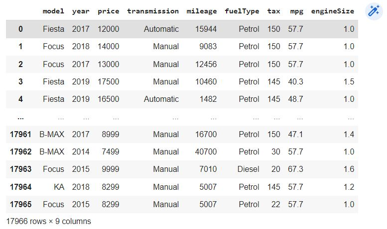

Keterangan mengenai informasi diatas adalah :
* Model : menjelaskan tipe mobil \
* Year : Tahun produksi mobil \
* Price : Harga mobil \
* Transmission : Transmisi yang digunakan (Manual / Matic)
* Milage : Jarak tempuh dari mobil
* Fuel Type : Jenis bahan bakar yang digunakan (Petrol, Diesel, dsb)
* Tax : Pajak mobil
* MPG( mil per galon ) : Effisiensi penggunaan bahan bakar
* Engine Size : Ukuran mesin 

Deskripsi lebih lengkap mengenai data yang digunakan pada percobaan ini bisa dilihat di gambar dibawah :

Bisa dilihat beberapa data dan jenis datanya. Data berjenis kategorikal terdapat 3 variabel. Data berjenis numerikal terdapat 7 Variabel. Kemudian gambar dibawah menunjukkan statistik persebaran data yang ada :
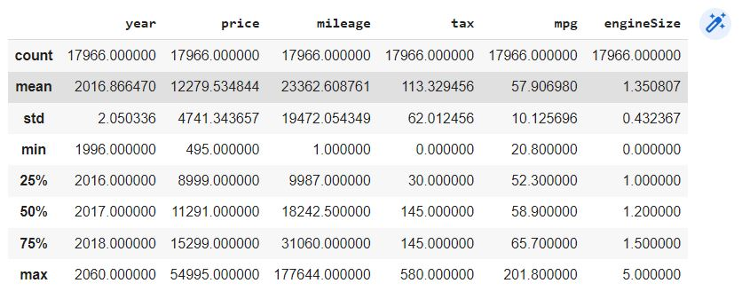

Dalam percobaan ini terdapat beberapa data dengan sampel yang cukup sedikit sehingga di khawatirkan dapat merusak hasil prediksi dari mobil. Oleh karena itu data perlu dibersihkan dengan cara memasukkan beberapa variabel dengan sampel yang sedikit ke dalam sebuah kelas bernama others supaya tidak merusak prediksi dari model. Bisa dilihat pada gambar dibawah :

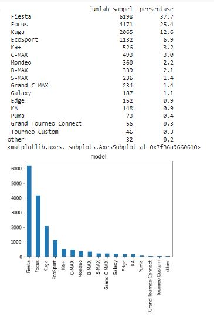

Setelah dihapus maka data menjadi :

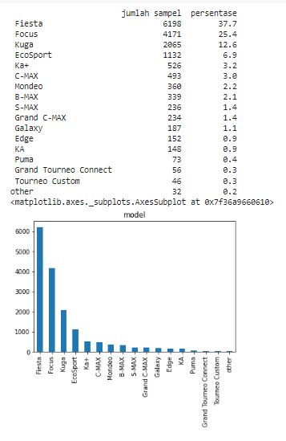

Gambar dibawah menunjukkan hubungan antara beberapa variabel lainnya dalam memengaruhi harga mobil :

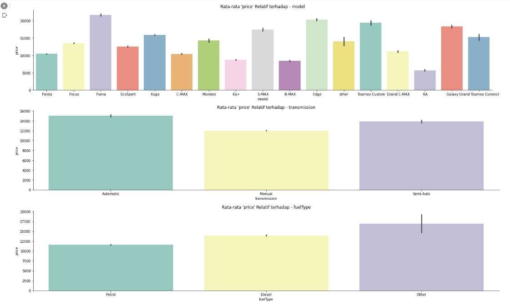

Data numerik :

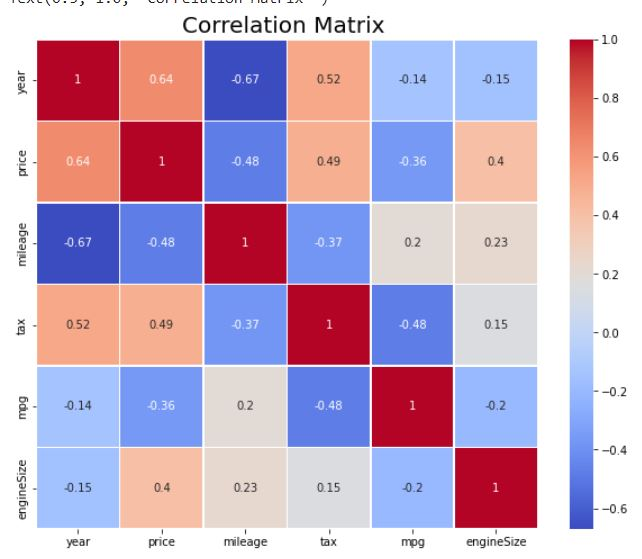

Cara mengartikan data numerik tersebut adalah melihat nilai yang ada pada kotak. Semakin besar menuju 1 berarti data berkolasi secara searah, dan apabila mendekati -1 maka data berkolerasi secara terbalik.
## Data Preparation
***
Beberapa proses preparation data yang dilakukan adalah :
* Mengganti row harga (price) dengan klasifikasi kelas harga\

Proses ini dilakukan untuk membuat klasifikasi kelas mobil. Sebelum membahas pengklasifikasin mari kita amati persebaran data pada gambar dibawah :

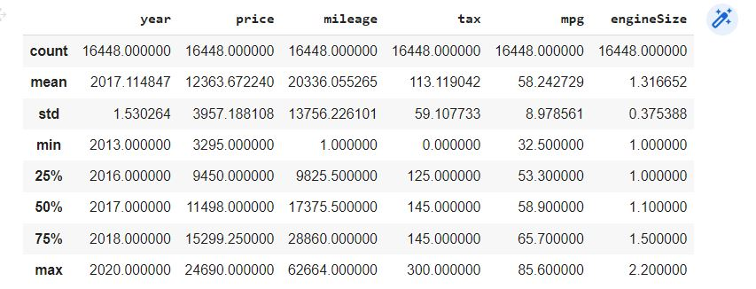

Pembagian kelas akan sesuai dengan kuartil pada harga. Harga yang berada dibawah kuartil 1 akan masuk kedalam kategori paling murah. Harga diatas kuartil 3 akan masuk kedalam kelas harga mobil dalam kategori paling mahal. Sehingga pada percobaan ini terdapat 4 kelas, yaitu sangat murah, murah, mahal dan sangat mahal. Sehingga data price berubah menjadi :

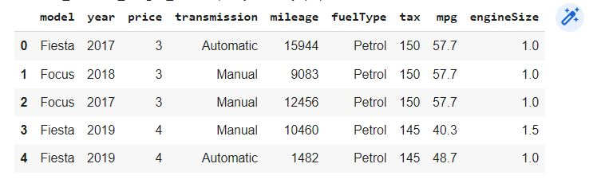

* One Hot-Encoding\
Proses ini dilakukan untuk mengubah data kategorikal kedalam bentuk numerik sehingga komputer bisa memproses data dengan mudah. Jenis kategori akan dibuatkan sebuah row baru yang berisi 1 atau 0. Row kategorikal akan dihapus dan digantikan dengan row baru tersebut. \
Sebelum dilakukan One Hot-Encoding :

Setelah proses One Hot-Encoding :

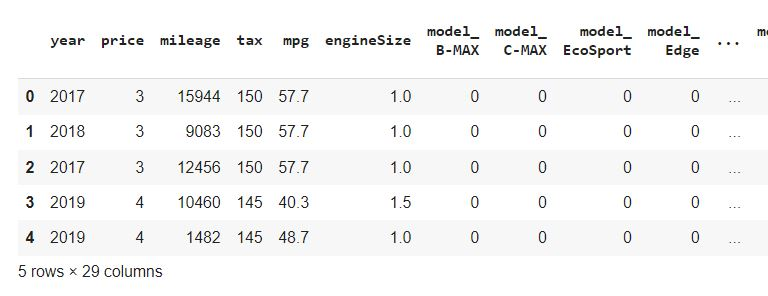

## Modelling
***
Model machine learning yang digunakan pada percobaan ini adalah KNN, Random Forest dan Adaptive Booster. Karena ketiga model tersebut adalah model yang dapat digunakan untuk proses klasifikasi.
1. KNN (K-Nearest Neighbor)\
    Merupakan metode pengklasifikasian dengan cara mencari data uji yang paling dekat dengan data hasil pengelompokan sesuai fitur yang ada. KNN memiliki kelebihan yang handal dan ringan. Namun algoritma ini memiliki kekurangan yaitu hasil uji akan buruk apabila terdapat banyak fitur inputan. Pada percobaan ini dilakukan training dengan neighbor sebanyak 12 data.
1. Random Forest \
Random forest bekerja seperti decision tree, namun dengan kompleksitas yang lebih. Random forest berisi banyak decision tree didalamnya. Kelebihan model ini adalah dapat melakukan klasifikasi data dengan sangat baik pada data yang berukuran besar. Kekurangan dari algoritma ini adalah apabila ingin mendapatkan hasil prediksi yang lebih baik dibutuhkan lebih banyak layer sehingga membutuhkan komputasi yang lebih tinggi dan waktu pemrosesan yang menjadi lebih lama. Pada percobaan ini beberapa hyperparameter yang digunakan adalah n_estimators=100, max_depth=72. Artinya terdapat 100 buah decisionTree dengan kedalaman 72.
2. Adaptive Booster \
 Algoritma ini bekerja dengan cara melatih 2 model secara bersamaan, kemudian dianalisa hasil prediksinya. Model yang lemah akan digabungkan dengan model yang lain sehingga bisa menghasilkan model yang lebih kuat. Dalam percobaan ini dilakukan proses pembelajaran dengan hyperparameter learning rate : 0.001.
 ## Evaluation
 ***
Gambar dibawah merupakan hasil plot dari hasil training algoritma yang dilakukan :

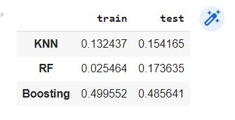

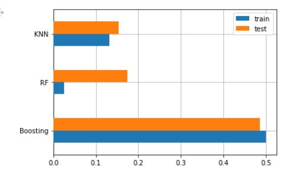

Grafik diatas merupakan grafik pemetaan dari Mean Squared Error (MSE). MSE merupakan sebuah cara untuk melihat eroor hasil prediksi. Untuk lebih jelas silahkan buka [link](https://en.wikipedia.org/wiki/Mean_squared_error) berikut. Cara kerja dari MSE adalah dengan menguadratkan (hasil prediksi - nilai aktual). Kemudian proses ini dilakukan pada semua data dan dijumlahkan satu sama lain. Hasil penjumlahan tersebut kemudian dibagi dengan banyaknya data yang ada. Nilai akhir itulah yang disebut dengan MSE. Pada grafik diatas bisa dilihat bahwa algoritma yang bisa bekerja paling baik diantara model lainnya adalah random forest dengan MSE 0,02 pada data train dan 0,17 pada data uji.

Dibawah merupakan hasil prediksi yang bisa dilakukan dengan model :

 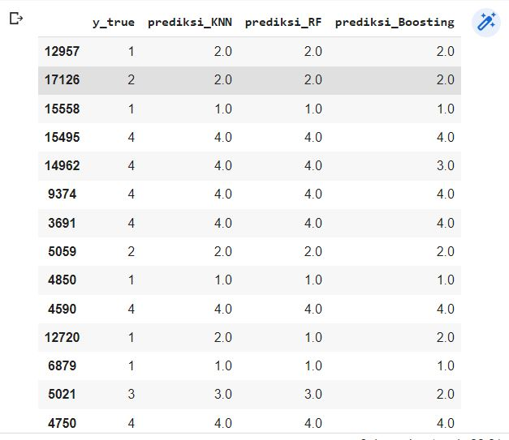 

Bisa  dilihat bahwa algoritma random forest bisa menebak kelas mobil sesuai harga dengan baik, lebih baik dibanding algoritma lain yang dicoba pada percobaan ini.

